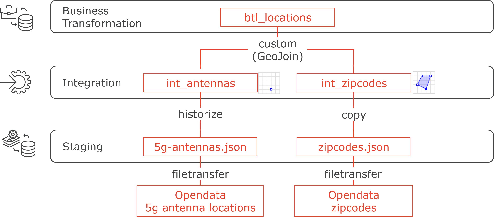
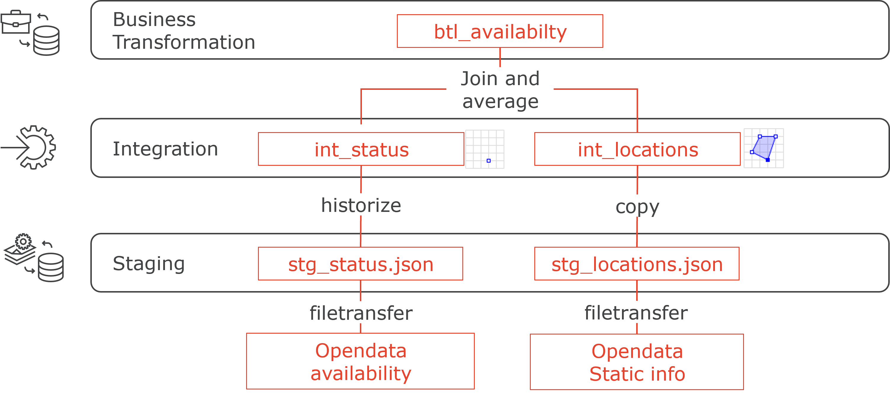

# Hands-On

## Task
* split into groups of **2** or 3
* find use case you implement next week in a 4h session
  - input: data sources (webservice or file or (local) database)
  - output: targets (simplest: CSV, or DeltaLake, or other)
  - multiple dataObjects and actions
  - suggestion: at least one transformation (more than data copy)
  - sketch dataObjects and actions with main properties/operations
  - see https://smartdatalake.ch/JsonSchemaViewer/ for inspiration

## Agenda
* 13:00 Questions from 1st half-day?
 * What is SDLB exactly… vs local development environment
	 [executionEngines](https://github.com/smart-data-lake/smart-data-lake/blob/documentation/docs/reference/executionEngines.md)
* Expectations for 2nd half-day?
* Infos: 
  - SDLB Open Source - get involved!
		+ Create tickets for bugs and suggestions
			- Developer Circle?
			- Teams channel?
			-Weekly sync…
		+ Create a blogpost from your use case?
		+ create SDLB github tickets
	- Databricks partnership
	- Goals 2023: Saas solution like DBT? Databricks marketplace?
* 13:15 Similar to Hackathon
	- Presentation use cases (5mins each) + discuss methods, feasability etc. (5mins)
	- Backup cases when needed
* 14:00 Work
* 16:15 Show your work 5mins: What worked, what not? Next stepst?
* 16:45 Feedback

## Backup Case: 5G data
### Target
calculate 5G antenna density instide zip code (PLZ) areas

### Data
[5g antenna positions and metadata](https://opendata.swiss/dataset/5g-mobilfunknetze-nr-antennenstandorteþtps://data.geo.admin.ch/ch.bakom.mobil-antennenstandorte-5g/data/ch.bakom.mobil-antennenstandorte-5g_en.json)
[PLZ directory](https://opendata.swiss/dataset/plz_verzeichnisþtps://swisspost.opendatasoft.com/api/v2/catalog/datasets/plz_verzeichnis_v2/exports/csv)

### Target pipeline

* download and historize 5g antenna data
* create delta lake tables
* combine antenna data with zip code data

## Electro car charging station

### Data
* [static station information](https://data.geo.admin.ch/ch.bfe.ladestellen-elektromobilitaet/data/oicp/ch.bfe.ladestellen-elektromobilitaet.json)
* [station availability](https://data.geo.admin.ch/ch.bfe.ladestellen-elektromobilitaet/status/oicp/ch.bfe.ladestellen-elektromobilitaet.json) (continuously updated)

### Target pipline

* download multiple samples and historize availability
* create delta lake tables
* combine avialabilty with location data
* compute availability average

