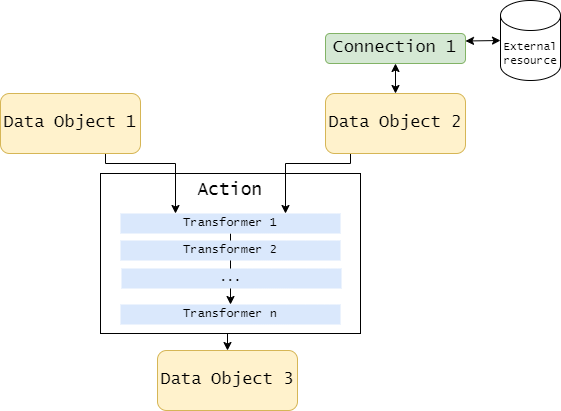
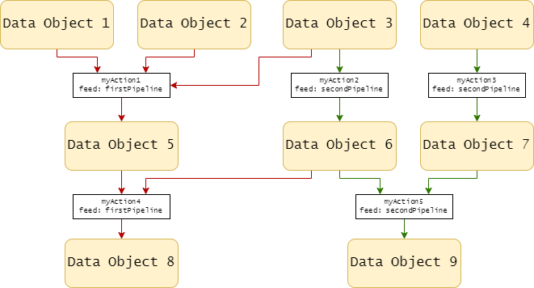
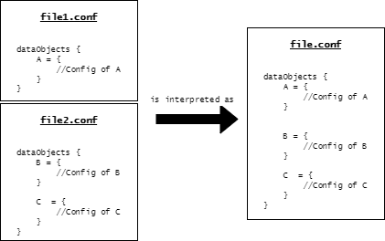

# Smart Data Lake Builder Hands-On Training
Welcome! We are very happy to have you here today! Before starting, there are two organizational points to clear up:

**Training agenda:** The training is divided into two parts / days. 
	1. The first part of the training focuses on the theoretical concepts of the framework. The goal of this session is to arm you with the necessary knowledge for you to build your own pipelines and prepare for the second session. 
	2. The second part is almost only hands-on: you will be divided into groups and will build a data pipeline. At the end of the session you will present your solution to the group.

- **For ELCA colleagues:** beside the on-site training time, participants are entitled to use additional 8h for:
	- Setup preparation
  	- Self-paced exercises with SDLB
    	+ lecture notes: https://github.com/smart-data-lake/getting-started/blob/training/presentation/lecture_notes.md
  	- Preparation of use case


<!-- 
Tools: In Teams annotation can be used to point to specific aspects in the configs, SchemaViewer,...
-->

<!-- 
- emphasize that this is and interactive course, motivate for questions
- provide lecture afterwards
- long commands should be pasted in the chat
- ask to follow along and try yourself, no intensive development today, but goal to use the framework by yourself

- icebreaker, the largest amount of data sources or tables you worked with in a single project
-->

## Goal
* train loving friend imagine to **replace** short distant flights **with train** rides
* discover/count all flights which
  - starting from a certain airport 
  - flight distance <500km
  - assume destination airport Bern (LSZB) or Frankfurt (EDDF)


* Let's try to abstract this use case... As data engineers, we want to provide elevated data for data scientists and business. **General steps to be followed**:
  - download data
  - combining/filter/transform data in a general manner
  - store processed data, thus it can be utilized for various use cases
  - analyse/compute data for a specific application
  - different data layers 
    - stage layer (raw data)
    - integration layer (cleaning/structuring/prepared data)
    - business transformation layer (ready for data analysts/scientists to run/develop their applications)


The Smart Data Lake Builder (SDLB) is the tool we will use to accomplish these steps. Let us take a step back for the moment. We will come back to our use-case in a couple of minutes.

## Smart Data Lake vs. Smart Data Lake Builder

| Smart Data Lake                       | Smart Data Lake Builder                                                       |
|--------------------------------------------------------------|-------------------------------------------------------------------------------|
| **Concept**                                                  | **Tool**                                                                      |
| combines advantages of Data Warehouse and Data Lakes         | ELCA's tool to build Data Pipelines efficiently                               |
| structured data / schema evolution                           | portable and automated                                                        |
| layer (here stg/int/btl) approach / processes / technologies | features like historization, incremental load, partition wise                 |
| Similar to Lakehouse (for more details see [this paper](https://www.cidrdb.org/cidr2021/papers/cidr2021_paper17.pdf)) | Open Source on Github: [smart-data-lake](https://github.com/smart-data-lake/) |

### Why Smart Data Lake Builder (SDLB)?
* defining dataObjets and relation instead of dependency in whole tree -> well suited for complex data pipelines
* **No Code** for standard dataObjects and tasks (historize, de-duplication, column name standardization)
* loading modes out of the box (incremental, partition-wise, streaming, checkpoint/recovery)
* Designed to add custom dataObjects, connectors, and transformers
* DevOps ready: version-able configuration, support for automated testing
* early validation
* portable -> on any platform with java env., even across platforms

## Setup
* clone repo
  ```
  git clone -b training https://github.com/smart-data-lake/getting-started.git SDLB_training
  ```
  OR update:
  ```
  git pull
  git checkout training
  ```

## SDLB general aspects
<!--
  during building lets have a closer look to SDLB
-->
* [https://github.com/smart-data-lake](https://github.com/smart-data-lake)
* Scala project, build with Maven
* with different modules: beside the core we have modules for different platforms, formats and other features
* GPL-3 license 

* we build SDLB core package with additional custom packages. Here we have 2 additional files (Scala classes) with *custom web downloader* and *transformer*
* reuse of artifacts from mounted directory in mvn container


## Hocon - Pipeline Description
* [**H**uman-**O**ptimized **C**onfig **O**bject **N**otation](https://github.com/lightbend/config/blob/main/HOCON.md)
* originating from JSON
* great features, like variables/references

Let's start writing a config
> open new file `test_config.conf` <br>
> what to write? -> Schema viewer

### Schema Viewer - What is supported?
> open [SDLB Schema Viewer](https://smartdatalake.ch/json-schema-viewer/#viewer-page)
* distinguish `global`, `dataObjects`, `actions`, and `connections`

### QUIZ TIME!

<details>
<summary>Click here to show the question 1</summary>

### Question 1: What is true about the SDLB?

- **A** -> It combines the advantages of a Data Warehouse and Data Lakes
- **B** -> It is a .NET-based application for data orchestration
- **C** -> It includes features like historization, incremental load and partitioning
- **D** -> It features runtime validation while transferring the data
- **E** -> Its main elements comprise data objects, activities and connections.


- [ ] A, C and E.
- [ ] A and C.
- [ ] B and E.
- [ ] B, C and D.
- [ ] Only C.

<details>
<summary>Answer</summary>

**Only C** is correct!
</details>

</details>


> write sections `dataObjects { }` and `actions { }` in our new config file.

<!-- DO THIS PART with SchemaViewer -->


### DataObjects
There are data objects of different types: files, database connections, and table formats. In other words, dataObjects define data entities and how they can be accessed by properties including location, type and others.
To mention **a few** dataObjects:

* `JdbcTableDataObject` to connect to a database e.g. MS SQL or Oracle SQL
* `KafkaTopicDataObject` to read from Kafka Topics
* `DeltaLakeTableDataObject` tables in delta format (based on parquet), including schema registered in metastore and transaction logs enables time travel (a common destination)
* `SnowflakeTableDataObject` access to Snowflake tables
* `AirbyteDataObject` provides access to a growing list of [Airbyte](https://docs.airbyte.com/integrations/) connectors to various sources and sinks e.g. Facebook, Google {Ads,Analytics,Search,Sheets,...}, Greenhouse, Instagram, Jira,...

### Actions
Actions describe dependencies between input and output DataObjects and necessary transformation to connect them. SDLB is designed to define/customize your own actions. Nevertheless, there are basic/common actions implemented and a general framework provided to implement your own specification

* ``FileTransferAction``: pure file transfer
* ``CopyAction``: basic generic action. Reads source into DataFrame and then writes DataFrame to target data object. Provides opportunity to add **transformer(s)**
* ``CostumDataFrameAction``: can handle **multiple inputs/outputs**
* ...
* actions with additional logic, e.g.
  - ``DeduplicateAction``: verifies to not have duplicates between input and output, keeps last record and history when *captured*
  - ``HistorizeAction``: technical historization using **valid-from/to** columns

#### Transformations
* distinguish between **1to1** (CopyAction, Dedup/Hist) and **many-to-many** (CustomDataFrame) transformations
* transformers supports languages:
  - ScalaClass
  - ScalaCode
  - SQL
  - Python
* transformers with additional logic, e.g.:
  - `StandardizeColNamesTransformer`
  - `AdditionalColumnsTransformer` (in HistorizeAction), adding information from context or derived from input, for example, adding input file name
  - `SparkRepartitionTransformer` for optimized file handling

What we have here:
* in `config/airports.conf` we already saw an SQL transformer
* in `config/departures.conf` look at `download-deduplicate-departures`
  - **chained** transformers
  - first **SQL** query, to convert UnixTime to dateTime format
  - then **Scala Code** for deduplication
    + the deduplication action does compare input and target
    + the transformation verifies that there are no duplicated in the input
* in `config/distances.conf` a Scala class is called
  - see `src/main/scala/com/sample/ComputeDistanceTransformer.scala`
    + definition and usage of distance calculation

> Note: *transformer* is deprecated



### config Structure

Let's have a look to the present implementation:

> **WSL**: `ls config ; ls envConfig` 
> <br>
> **IntelliJ**: show directory structure especially `config` and `envConfig` -> see multiple configuration files

* specification of the pipeline can be split in **multiple files** and even **directories**
  - -> directories can be used to manage different environments e.g. 

```
config
+-- global.conf
+-- sourceA.conf
+-- sourceB.conf
+-- app1.conf
envConfig
+-- local.conf
+-- awsDev.conf
+-- azureDev.conf
```

Let's have a look into a configuration file:
> `config/airports.conf` 
> <br>
> WSL tipp: There are a bunch of viewers and editors. Simplest may be `nano`. From Windows, you can SublimeText or IntelliJ using `\\wsl$\Ubuntu\home\<username>\...`

* 3 **data objects** for 3 different layers: **ext**, **stg**, **int**
  - here each data object has a different type: WebserviceFileDataObject, CsvFileDataObject, DeltaLakeTableDataObject
  - `ext_airports`: specifies the location of a file to be downloaded 
  - `stg_airports`: a staging CSV file to be downloaded into (raw data)
  - `int_airports`: filtered and written into `DeltaLakeTable`

* 2 **actions** defining the connection between the data objects
  - first simple download
  - then filter and historize

* structures and parameters, like *type*, *inputId*,...
* **Transformer** will be handled later

<!--
## Excursion: env variables
- usage of optional env variables
  ```Hocon
  basedir = "/whatever/whatever"
  basedir = ${?FORCED_BASEDIR}
  ```
- overwrite parameters with env variables
  + specify java option `-Dconfig.override_with_env_vars=true` in Docker entrypoint and
  + env var:
    * prefix `CONFIG_FORCE_` is stripped
    * single underscore(`_`) is converted into a dot(`.`)
    * double underscore(`__`) is converted into a dash(`-`)
    * triple underscore(`___`) is converted into a single underscore(`_`)
:warning: TODO overwrite not working'
-->

### QUIZ TIME!

<details>
<summary>Click here to show question 2</summary>

### Question 2: Which facts about data objects are correct?

- **A** -> Data objects describe dependencies between data entities
- **B** -> If a pipeline results in two .CSV files as output (using the CSVFileDataObject type), 
it also must have two corresponding two input data objects.
- **C** -> Data objects can have many transformers.
- **D** -> None of the possibilities are correct.


- [ ] A and B.
- [ ] A and C.
- [ ] B and D.
- [ ] Only D.

<details>
<summary>Answer</summary>

**Only D** is correct!
</details>

</details>

<details>
<summary>Click here to show question 3</summary>

### Question 3: Which is true about actions?

- **A** -> Actions describe dependencies between data entities
- **B** -> If a pipeline results in two .CSV files as output (using the CSVFileDataObject type),
  it also must have two corresponding actions.
- **C** -> Actions can have many transformers.
- **D** -> None of the possibilities are correct.


- [ ] A and B.
- [ ] A and C.
- [ ] B and C.
- [ ] Only D.

<details>
<summary>Answer</summary>

**A and C** are both correct!
</details>

</details>

<details>
<summary>Click here to show question 4</summary>

### Question 4: Where are the credentials to a SQL-database defined?


- [ ] In the actions.
- [ ] In the connections.
- [ ] In the data objects.

<details>
<summary>Answer</summary>

Credentials are defined **in the connections**
</details>

</details>

### PUZZLE TIME!

<details>
<summary>Click here to show the puzzle 1</summary>


It is now time to continue building our pipeline. 
We want the pipeline to do the following:

1. Download the airports data from the given link as a
.csv file. 
2. Store the airports table only with the attributes 
*identity*, _name_, _latitude degree_ and _longitude degree_ in
the **Delta Lake format**.
3. Furthermore, we want to store .csv File containing
also the airport elevation. Since we have colleagues 
both in the USA and in Europe, we want to provide 
the airport elevation both in feet and in meters. For this
file, it suffices that we provide the attributes 
_airport_name_, _elevationInFeet_ and _elevationInMeters_.

In order to build the pipeline, consider the following:
- How many data objects and actions do you need in total?
How many did we already configure?
- Which configuration fields are possible? Which ones are required?
  (Use the Schema Viewer!)
- We want to use the Lakehouse Architecture. How can the 
components be named properly?

For this exercise, you are given some preconfigured data objects
and actions. The idea is that you use them to further
build your airports.config file.

TASK: Copy and paste the proper data objects and actions
into your airports.conf file!

</details>

## Three important concepts before testing our pipeline

### 1. Metadata and Feeds

Data Objects and Actions have metadata that serves as information
about the component. Metadata can refer to the name, the description, 
or some tags associated with the component. 
While metadata attributes are optional, they can be very useful 
in some situations, as it is the case of *feeds*:


Often we do not want to run all defined pipelines. 
Especially during development, debugging or in various use case,
we rely on running only parts. This may be just a single action/transformation, 
or downloading everything. The way we define the parts we want to run is by 
associating actions with so-called *feeds*. Feeds can be understood as markers for 
"sub-pipelines" within one greater pipeline. 
The following example has two feeds:




Feeds are inserted into the metadata as follows:

```
actionName {
  type = actionType
  input = some-input-dataObject
  output = some-output-dataObject
  metadata {
    feed = feedName
  }
}
```

### 2. Combining HOCON files and setting environment variables

The structures in SDLB are very flexible, not only can 
building blocks (data objects, actions, etc.) be separated in 
different files and directories, but also used in various 
locations. Thus, e.g. team members can write their 
configuration files for the creation of separate pipelines 
while re-using common configurations. This is possible since 
SDLB merges all selected configuration files into one stream.




> **TIPP**: One way of using this feature is defining *templates*.
> Imagine having to migrate 2000 tables from the same database.
> Instead of writing the same connection information in each
> source data object, we can use a template and only adapt the
> parameter of the table name!

```
templates {
  myTemplate {
    type = JdbcTableDataObject
    connectionId = myConnectionId
    metadata.feed = load_tables
  }
}

dataObjects {
  departures-table = ${templates.myTemplate} {
    table.name = departures
  }
  
  arrivals-table = ${templates.myTemplate} {
    table.name = arrivals
  }
  
  airports-table = ${templates.myTemplate} {
    table.name = airports
  }
}

```

Furthermore, we can define environment variables that aren't hardcoded in
our .config files, but that are passed as an argument whenever
we start the SDLB. They are defined as follows:

```
authentication {
  user = ${USER_PARAM}
  password = ${PW_PARAM}
  path = ${DATALAKEPREFIX}
}
```

> **Survey:** Can you find out where to pass environment variables as parameters
> in IntelliJ?

### PUZZLE TIME!

<details>
<summary>Click here to show the puzzle 2</summary>


Before testing our pipeline, we want to write some metadata
into our data objects and actions. We also want to
replace some code blocks with template definitions and
environment variables. Please use these puzzle parts and 
consider the following:

- Which feeds make sense? Which ones are not really useful?
- Check out the envConfig/ folder to search for some
existing templates.
- Do you have to overwrite some of the exiting code?

Paste the code blocks into your airports.conf file! 
</details>

Change lecturers
## Time to test the pipeline
Let's run SDLB_part2 template from IntelliJ.
While it runs inspect the command

start application with `--help`: 

* `feed-sel` always necessary 
	- can be specified by metadata feed, name, or ids
	- can be lists or regex, e.g. `--feed-sel '.*airport.*'` **Note**: on CLI we need `'.*'` in IntelliJ we can directly use `.*`
	- can also be `startWith...` or `endWith...`

### DAG
* (Directed acyclic graph)
> show DAG in output
* automatically created using the specifications in the SDLB config.
* can fork and join
* no recursion

```
                        ┌─────┐          
                        │start│
                        └─┬─┬─┘
                          │ │
                          │ └─────────┐
                          v           │
           ┌─────────────────┐        │
           │download-airports│        │
           └────────┬────────┘        │
                    │                 │
           ┌────────┘                 │
           │                          │
           v                          v
 ┌──────────────────┐ ┌───────────────────────────────┐
 │historize-airports│ │download-deduplicate-departures│
 └─────────┬────────┘ └────────┬──────────────────────┘
           │                   │
           └───────────┐       │
                       │       │
                       v       v
              ┌────────────────────────┐
              │join-departures-airports│
              └────────────┬───────────┘
                           │
                           v
                  ┌─────────────────┐
                  │compute-distances│
                  └─────────────────┘
```

  show result files


### 3. Execution phases

The SDLB executes the following phases on each run:

1. **Configuration parsing**
2. **DAG preparation**: Preconditions are validated. This includes testing Connections and DataObject structures that must exists.
3. **DAG init**: Creates and validates the whole lineage of Actions according to the DAG. For Spark Actions this involves the validation of the DataFrame lineage.
4. **DAG exec**:  Data is effectively transferred in this phase (and only in this phase!). This phase is not processed in dry-run mode.
* early validation: in init even custom transformation are checked, e.g. identifying mistakes in column names
* [Docu: execution phases](https://smartdatalake.ch/docs/reference/executionPhases)


### Schema handling

add foobar in download-deduplicate-departures:
SDLB checked the schema (expected columns of the DataObjects and saw that foobar is not expected there, before executing anything)

* execution fail in init phase by because of not finding "foobar" column in `download-deduplicate-departures`:

```
2022-08-05 07:51:14 INFO  ActionDAGRun$ - Init FAILED for sdlb_training :
                       ┌─────┐
                       │start│
                       └──┬┬─┘
                          ││
                          │└─────────────────────────┐
                          v                          │
 ┌─────────────────────────────────────────────────┐ │
 │download-deduplicate-departures FAILED PT0.31359S│ │
 └───────────────────┬─────────────────────────────┘ │
                     │           ┌───────────────────┘
                     │           │
                     v           v
         ┌──────────────────────────────────┐
         │join-departures-airports CANCELLED│
         └────────────────┬─────────────────┘
                          │
                          v
            ┌───────────────────────────┐
            │compute-distances CANCELLED│
            └───────────────────────────┘
     [main]
Exception in thread "main" io.smartdatalake.util.dag.TaskFailedException: 
    Task download-deduplicate-departures failed. 
    Root cause is 'AnalysisException: cannot resolve 'foobar' given input columns: 
        [ext_departures_sdltemp.arrivalAirportCandidatesCount, ext_departures_sdltemp.callsign, 
        ext_departures_sdltemp.created_at, ext_departures_sdltemp.departureAirportCandidatesCount, 
        ext_departures_sdltemp.estArrivalAirport, ext_departures_sdltemp.estArrivalAirportHorizDistance, 
        ext_departures_sdltemp.estArrivalAirportVertDistance, ext_departures_sdltemp.estDepartureAirport, 
        ext_departures_sdltemp.estDepartureAirportHorizDistance, ext_departures_sdltemp.estDepartureAirportVertDistance, 
        ext_departures_sdltemp.firstSeen, ext_departures_sdltemp.icao24, ext_departures_sdltemp.lastSeen]; 
        line 1 pos 7;'
```

* SDLB does schema validation, creates Schemata for all spark supported data objects: user defined or inference
    - support for schema evolution 
      + replaced or extended or extend (new column added, removed columns kept) schema 
		+ for JDBC and DeltaLakeTable, need to be enabled

## Data Quality
><details><summary>Quizztime</summary>
> Q: After you built your pipeline, how do you know if it does what you expect?
> 
> A: If it did not crash it was a success
> A: Look at some Data Samples of the output with your intuition
> A: Define some rules on your output and execute Queries on the whole output
></details>
Look at documentation here: https://smartdatalake.ch/docs/reference/dataQuality

### Constraints
Add new constraint on dataObject btl_distances

```
    constraints = [{
      name = Departure Airport should be different from Arrival Aiport
      description = "A flight from A to A makes no sense"
      expression = "estarrivalairport != estdepartureairport"
      errorMsgCols = [estdepartureairport,estarrivalairport, arr_name, arr_latitude_deg, arr_longitude_deg, dep_name, dep_latitude_deg, dep_longitude_deg]
    }]
```

Execute SDLB on partition estdepartureairport=LSZB (SDLB_data_quality)
`-c $ProjectFileDir$/config,$ProjectFileDir$/envConfig/local_Intellij.conf --feed-sel compute --partition-values estdepartureairport=LSZB`
It will fail.
Then show the debugger by putting a breakpoint at the end of com.sample.ComputeDistanceTransformer.transform.
Let's see if there is data that violates constraint.
Fix it by uncommenting the where clause.

### Expectations
add new constraint on dataObject btl_distances
```
    expectations = [{
      type = SQLFractionExpectation
      name = RailPessimist
      description = "most flights could be replaced by rail"
      countConditionExpression = "could_be_done_by_rail = true"
      expectation = "< 0.5"
      failedSeverity = "Warn"
    }]
```
Notice the warning.
We will come to metrics later when we talk about state.

## Partitions
><details><summary>Quizztime</summary>
> Q: After partitioning your data...
> A: You have more data than before
> A: *You have divided your data into multiple pieces
> A: * You can access data faster
> A: Your data uses up less space
></details>

First have a look at `data/btl_distances`.

There are two subdirectories named with the partition name and value.

**Task**: recompute `compute-distances` only with/for partition `LSZB` <br>
**Hint**: use CLI help

><details><summary>Solution: Click to expand!</summary>
> (SDLB_new_partition config file)
> * specify a new partition: CLI option `--partition-value`
> * Here we need: `--partition-values estdepartureairport=EDDM` with `--feed-sel .*` to download the new data for departures from munich
> * > * `-DdataObjects.ext_departures.queryParameters.0.airport=EDDM
        -DdataObjects.ext_departures.queryParameters.0.begin=1630200800
        -DdataObjects.ext_departures.queryParameters.0.end=1630310979`
> * Execute <br>
>   * **IntelliJ**: `-c $ProjectFileDir$/config,$ProjectFileDir$/envConfig/local_Intellij.conf --feed-sel ids:compute-distances --partition-values estdepartureairport=LSZB`
></details>

When you now look at data/btl_distances, you will only see an a new folder estdepartureairport=EDDM 
and in the logs you find: `start writing to DataObject~btl_distances, partitionValues estdepartureairport=EDDM [exec-compute-distances]`)

Working with partitions forces to create the whole data pipeline around them <br> 
-> **everything needs to be partitioned** by that key. <br>
The trend goes towards incremental processing (see next chapter).
But batch processing with partitioning is still the most performant data processing method 
when dealing with large amounts of data.

## Execution Modes
for Actions there are different execution modes, including various incremental modes, e.g.:
  - see https://smartdatalake.ch/docs/reference/executionModes#dataobjectstateincrementalmode

### Incremental Load
Here we use `DataObjectStateIncrementalMode`: 
* 
* * desire to **not read** (and write) **all** data from input at every run -> incrementally
* or **here**: departure source **restricted request** to <7 days
  - initial request 2 days 29.-20.08.2021
* To enable stateIncremental we need to change the action `download-deduplicate-departures` and set these parameters of the DeduplicateAction:
  ```
    executionMode = { type = DataObjectStateIncrementalMode }
  ```
  
### Current Example
Let's try out StateIncremental with the action `download-deduplicate-departures` 
* state is used to store last position
  - To be able to use the StateIncremental mode [CustomWebserviceDataObject](https://github.com/smart-data-lake/getting-started/blob/training/src/main/scala/io/smartdatalake/workflow/dataobject/CustomWebserviceDataObject.scala) needs to:
    + Implement Interface `CanCreateIncrementalOutput` and defining the `setState` and `getState` methods
    + instantiating state variables
    + see also [getting-started example](https://smartdatalake.ch/docs/getting-started/part-3/incremental-mode)

These Requirements are already met. &#10004;

After changing our config, try to execute the concerned action
> * **WSL**: `sdlb_cmd --feed-sel ids:download-deduplicate-departures`
> * **IntelliJ**: `-c $ProjectFileDir$/config,$ProjectFileDir$/envConfig/local_Intellij.conf --feed-sel ids:download-deduplicate-departures`

Now it will **fail** because we need to provide a path for the state-path. 
><details><summary>Quizztime</summary>
> Q: Where is the state stored for DataObjectStateIncrementalMode?
> A: In Memory
> A: In One Central File
> A: In one file per run
></details>
Add state path and name: (SDLB_state config file)
> * **WSL**: `sdlb_cmd --feed-sel ids:download-deduplicate-departures --state-path /mnt/data/state -n SDLB_training`
> * **IntelliJ**: `-c $ProjectFileDir$/config,$ProjectFileDir$/envConfig/local_Intellij.conf --feed-sel ids:download-deduplicate-departures --state-path $ProjectFileDir$/data/state -n SDLB_training`


* **first run** creates `data/state/succeeded/SDLB_training.1.1.json` 
  - see line `"state" : "[{\"airport\":\"LSZB\",\"nextBegin\":1630310979},{\"airport\":\"EDDF\",\"nextBegin\":1630310979}]"`
    + > other content will be regarded later
  - this is used for the next request
* see next request in output of **next run**:
  `CustomWebserviceDataObject - Success for request https://opensky-network.org/api/flights/departure?airport=LSZB&begin=1631002179&end=1631347779 [exec-download-deduplicate-departures]`
> run a couple of times
  - check the increasing amount of lines collected in table
>* **WSL**: [Polynote](http://localhost:8192/notebook/inspectData.ipynb#Cell4)
>* **IntelliJ**: Parquet Viewer

> Note: When get result/error: `Webservice Request failed with error <404>`, if there are no new data available. 


## Streaming
* continuous processing, cases we want to run the actions again and again

### Command Line
* command line option `-s` or `--streaming`, streaming all selected actions
  - requires `--state-path` to be set
> * **WSL**: `sdlb_cmd  --feed-sel ids:download-deduplicate-departures --state-path /mnt/data/state -n SDLB_training -s` 
> * **IntelliJ**: `-c $ProjectFileDir$/config,$ProjectFileDir$/envConfig/local_Intellij.conf --feed-sel ids:download-deduplicate-departures --state-path $ProjectFileDir$/data/state -n SDLB_training -s`
* and see the action running again and again
* (IntelliJ Config SDLB_Streaming)

-> notice the recurring of the action
-> monitor the growth of the table
-> possible see streaming trigger interval of 48s in output: `LocalSmartDataLakeBuilder$ - sleeping 48 seconds for synchronous streaming trigger interval [main]` otherwise process took more than 60 sec  

Task: change the streaming trigger interval to 10s (or alternatively to 120s)
Hint: search for streaming in [Schema Viewer](https://smartdatalake.ch/json-schema-viewer/)

> <details><summary>Solution: Click to expand!</summary>
>
> search interval in Schema Viewer 
> and add to the `config/global.conf` -> `global`->`synchronousStreamingTriggerIntervalSec = 10` 
> This defines the interval between 2 starts (not end to start)
> </details>
 
  * Now output looks like this :
    ```
      2022-08-04 10:56:28 INFO  ActionDAGRun$ActionEventListener - Action~download-deduplicate-departures[DeduplicateAction]: Exec succeeded [dag-24-651]
      2022-08-04 10:56:28 INFO  HadoopFileActionDAGRunStateStore - updated state into file:/mnt/data/state/current/SDLB_training.24.1.json [dag-24-651]
      2022-08-04 10:56:28 INFO  ActionDAGRun$ - exec SUCCEEDED for dag 24:
      ┌─────┐
      │start│
      └───┬─┘
      │
      v
      ┌─────────────────────────────────────────────────────┐
      │download-deduplicate-departures SUCCEEDED PT4.829176S│
      └─────────────────────────────────────────────────────┘
      [main]
      2022-08-04 10:56:28 INFO  HadoopFileActionDAGRunStateStore - updated state into file:/mnt/data/state/succeeded/SDLB_training.24.1.json [main]
      2022-08-04 10:56:28 INFO  LocalSmartDataLakeBuilder$ - sleeping 5 seconds for synchronous streaming trigger interval [main]
    ```
    
**Note**: there is also the `SparkStreamingMode` you may want to use for the action

## Checkpoint / Restart
><details><summary>Quizztime</summary>
> Q: What does the 1.1 mean in the file SDLB_training.1.1.json ?
> A: Version Number of SDLB used
> A: Version Number of Spark used
> A: Hash of the Data that was processed
> A: Run id and attempt id
></details>
When the run crashes we want to restart from where we left and only run remaining tasks. Especially when handling large datasets.
* requires states (`--state-path`)

Let's try.
> Since we use states already, just run again (**serial**, no log file necessary) and cancel inbetween
> * **WSL**: `sdlb_cmd --feed-sel .* --state-path /mnt/data/state -n SDLB_training`
> * **IntelliJ**: CLI arguments `-c $ProjectFileDir$/config,$ProjectFileDir$/envConfig/local_Intellij.conf --feed-sel .* --state-path $ProjectFileDir$/data/state -n SDLB_training`

-> cancel run to simulate crash (**after download** phase when seeing in the logs):
```
(Action~download-airports) finished writing DataFrame to stg_airports: jobDuration=PT0.871S files_written=1 [exec-download-airports]
...
ActionDAGRun$ActionEventListener - Action~download-deduplicate-departures[DeduplicateAction]: Exec succeeded [dag-1-191]
```

* inspect **current** state in file: `data/state/current/SDLB_training.?.?.json`
  - see the SUCCESS and CANCELED statements
* restart with the same command
  - notice line at the beginning: `LocalSmartDataLakeBuilder$ - recovering application SDLB_training runId=1 lastAttemptId=1 [main]`
  - notice the changed DAG, no download


## Parallelism
Distinguish 2 types of parallelism:
  - within a spark job: the amount of Spark tasks, controlled by global option `    "spark.sql.shuffle.partitions" = 2`
  - parallel running DAG actions of SDLB, by default serial, *one by one* action
    + see `Action~download-airports[FileTransferAction]: Exec started` and `Action~download-deduplicate-departures[DeduplicateAction]`
    + use command line option `--parallelism 2` to run both tasks in parallel. compare:

First, measure serial run: 
> * **WSL**: `sdlb_cmd --feed-sel .* --state-path /mnt/data/state -n SDLB_training >& out.serial`
> * **IntelliJ**: 
>   * CLI arguments `-c $ProjectFileDir$/config,$ProjectFileDir$/envConfig/local_Intellij.conf --feed-sel .* --state-path $ProjectFileDir$/data/state -n SDLB_training`
>   * Save console output file: `$ProjectFileDir$\out.serial`

Then run in parallel: adding `--parallelism 2` and change output file name
> * **WSL**: `sdlb_cmd --feed-sel .* --state-path /mnt/data/state -n SDLB_training --parallelism 2 >& out.parallel`
> * **IntelliJ**:
    >   * CLI arguments `-c $ProjectFileDir$/config,$ProjectFileDir$/envConfig/local_Intellij.conf --feed-sel .* --state-path $ProjectFileDir$/data/state -n SDLB_training --parallelism 2`
>   * Save console output file: `$ProjectFileDir$\out.prarallel`

* Without parallelsim (out.serial): Action2 starts only after Action1 is finished
  ```    
       2022-08-04 12:24:18 INFO  ActionDAGRun$ActionEventListener - Action~download-airports[FileTransferAction]: Exec started [dag-30-109]
       2022-08-04 12:24:18 INFO  FileTransferAction - (Action~download-airports) start writing to DataObject~stg_airports [exec-download-airports]
       2022-08-04 12:24:18 INFO  CsvFileDataObject - (DataObject~stg_airports) deleteAll stg_airports [exec-download-airports]
       2022-08-04 12:24:18 INFO  StreamFileTransfer - Copy DataObject~ext_airports:result -> DataObject~stg_airports:stg_airports/result.csv [exec-download-airports]
       2022-08-04 12:24:19 INFO  FileTransferAction - (Action~download-airports) finished writing DataFrame to stg_airports: jobDuration=PT0.984S files_written=1 [exec-download-airports]
       2022-08-04 12:24:19 INFO  ActionDAGRun$ActionEventListener - Action~download-airports[FileTransferAction]: Exec succeeded [dag-30-109]
       2022-08-04 12:24:19 INFO  HadoopFileActionDAGRunStateStore - updated state into file:/mnt/data/state/current/SDLB_training.30.1.json [dag-30-109]
       2022-08-04 12:24:19 INFO  ActionDAGRun$ActionEventListener - Action~download-deduplicate-departures[DeduplicateAction]: Exec started [dag-30-109]
       2022-08-04 12:24:19 INFO  DeduplicateAction - (Action~download-deduplicate-departures) getting DataFrame for DataObject~ext_departures [exec-download-deduplicate-departures]
  ```

* With parallelsim (out.parallel): Action2 starts while Action1 is still running
  ```    
       2022-08-04 12:23:08 INFO  ActionDAGRun$ActionEventListener - Action~download-airports[FileTransferAction]: Exec started [dag-29-93]
       2022-08-04 12:23:08 INFO  ActionDAGRun$ActionEventListener - Action~download-deduplicate-departures[DeduplicateAction]: Exec started [dag-29-94]
       2022-08-04 12:23:08 INFO  DeduplicateAction - (Action~download-deduplicate-departures) getting DataFrame for DataObject~ext_departures [exec-download-deduplicate-departures]
       2022-08-04 12:23:08 INFO  FileTransferAction - (Action~download-airports) start writing to DataObject~stg_airports [exec-download-airports]
       2022-08-04 12:23:08 INFO  CsvFileDataObject - (DataObject~stg_airports) deleteAll stg_airports [exec-download-airports]
       2022-08-04 12:23:08 INFO  StreamFileTransfer - Copy DataObject~ext_airports:result -> DataObject~stg_airports:stg_airports/result.csv [exec-download-airports]
       2022-08-04 12:23:09 INFO  CustomWebserviceDataObject - Success for request https://opensky-network.org/api/flights/departure?airport=LSZB&begin=1630310979&end=1630656579 [exec-download-deduplicate-departures]
       2022-08-04 12:23:09 INFO  FileTransferAction - (Action~download-airports) finished writing DataFrame to stg_airports: jobDuration=PT1.699S files_written=1 [exec-download-airports]
       2022-08-04 12:23:09 INFO  ActionDAGRun$ActionEventListener - Action~download-airports[FileTransferAction]: Exec succeeded [dag-29-93]
       2022-08-04 12:23:09 INFO  HadoopFileActionDAGRunStateStore - updated state into file:/mnt/data/state/current/SDLB_training.29.1.json [dag-29-93]
  ```
- :warning: parallel actions are more difficult to **debug**

## Execution Engines vs Execution Environments
[Go through documentation](https://smartdatalake.ch/docs/reference/executionEngines)
> Look at plot at bottom and explain when which Engine is running (see also table on top): 
> When copying Files, when copying Data from a File to a Spark Table,
> When Transforming Data with Snowflake via Snowpark
> When Transforming Data between Spark and Snowflake

If you are interested in trying out SDLB with Snowflake, you can follow this [Blog Post](https://smartdatalake.ch/blog/sdl-snowpark/)

## SDL Viewer
There is a new **extension** of SDLB which visualize the configuration and its documentation. 
This acts as a **data catalog** and presents beside the dependencies (DAG) **all metadata information** of dataObject and Actions. 
The viewer runs separately 

> * **WSL**: in a container,and can be launched browsing to [localhost:5000](http://localhost:5000).
> Note: there is still an issue with parsing "unresolved" variables. If you see just "Loading", 
> uncomment out the `$METASTOREPW` or `DATALAKEPREFIX` in `envConfig/local*.conf`.

# Exercise
> **Task**: create a new table provided in CSV format:
> * airports name
> * elevation in ft
> * and elevation in m 

> <details><summary>Solution: Click to expand!</summary>
> 
> * create a dataObject like
> ```
>  btl_airports_elevation { ### TODO remove for training
>    type = CsvFileDataObject
>    path = ${env.datalakeprefix}"/~{id}"
>    metadata {
>      name = "Calculated Airport elevation in meters"
>      description = "contains beside GPS coordiantes, elevation, continent, country, region"
>      layer = "staging"
>      subjectArea = "airports"
>      tags = ["aviation", "airport", "location"]
>    }
>  }
> ```
> * create an action using stg_airports as input and the above dataObject as output
> * e.g. with `SQLDfTransformer`: `code = "select name, elevation_ft, (elevation_ft / 3.281) as elevation_meters from stg_airports"`
> ```
> export-airport-elevations { ### TODO remove for training
>   type = CopyAction
>   inputId = stg_airports
>   outputId = btl_airports_elevation
>   transformers = [{
>     type = SQLDfTransformer
>     code = "select name, elevation_ft, (elevation_ft / 3.281) as elevation_meters from stg_airports" #Tricky, do not use comma but decimal point ;-)
>   }]
>   metadata {
>     name = "Airport elevation"
>     description = "Write airport elevation in meters to Parquet file"
>     feed = download-airport
>   }
>  }
> ```
> </details>

# SDLB feature summary
* [ ] Run **anywhere**
  * [ ] Integrations for major public **clouds** (as jar in Databricks, AWS Glue; container e.g. in Kubernetes; in VM)
* [ ] Support for different **Execution Engines** (Files, Spark, Snowflake for now)
* [ ] **Open-source**
* [ ] **easily-extendable** (Scala & Python)
* [ ] **reusable** generic transformations (SQL, Python, Scala)
* [ ] Automated, optimized **DAG** execution
* [ ] **Batch** and near-realtime **Streaming**
* [ ] **Automation Tool** with declarative, reusable configuration approach
* [ ] **Early Validation** of configuration and data pipeline schema problems
* [ ] **Large Connectivity**: Spark connectors (incl. Iceberg & Deltalake), Kafka, Files, SFTP, Webservice + Airbyte Connectors
* [ ] **Data Quality** checks, expectations & metrics integrated
* [ ] Support for Unit/Integration/Smoke **Testing**
* [ ] Integrated **MLOps** with MFLow (train & predict)
* [ ] Monitoring: metrics in logs, e.g. size of written DataFrame
* [ ] Constrains: specify limitations, error/warning when exceeding
* [ ] Expectations: notifications if diverging from specified expectation, e.g. number of partitions
* [ ] Housekeeping: 
  * PartitionRetentionMode:  Keep partitions while retention condition is fulfilled, delete other partitions
  * PartitionArchiveCompactionMode: Archive and compact old partitions -> Is now already covered by Deltalake
* [ ] Spark Specific Features: BreakDataFrameLineage and Autocaching

## RoadMap
Q1:
* Catalog support in Notebook (Scala)
* Integrated MLOps with MFLow (train & predict)
* Remote Agent support (Preview)
  Q2
* Extended Metrics Collection for Iceberg and Delta Lake
* Operations UI for visualizing Runtime Information
  H2:
* Language Server: Code completion for configuration files in Visual Studio Code and IntelliJ

2024:
* SaaS User Interface / Rebranding?

-----
# References
* SDLB source [github.com/smart-data-lake/smart-data-lake](https://github.com/smart-data-lake/smart-data-lake)
* Documentation [smartdatalake.ch/docs](https://smartdatalake.ch/docs/)
* Schema Viewer [smartdatalake.ch/json-schema-viewer/](https://smartdatalake.ch/json-schema-viewer/)
* getting started [github.com/smart-data-lake/getting-started](https://github.com/smart-data-lake/getting-started)

-----
# Homework
* split into groups of 2 or **3**
* find use case you implement next week in a 4h session
  - input: data sources (webservice or file or (local) database)
  - output: targets (simplest: CSV, or DeltaLake, or other)
  - multiple dataObjects and actions
  - suggestion: at least one transformation (more than data copy)
  - sketch dataObjects and actions with main properties/operations
  - see https://smartdatalake.ch/JsonSchemaViewer/ for inspiration

* next week:
  - first present and discuss ideas and analyze feasibility, methods to implement
  - you work together on the implementation and SDLB experts will assist you

------

# Additional Topics

### BreakDataFrameLineage and Autocaching
* By default, spark creates a plan of operations and process them if the target element needs to be realized
  - computation is performed again even if the data is written to a dataObject (file, or table,...)
* Spark provides an option called *cache* to keep the created data in memory
* SDLB uses this option by default for all defined dataObjects, thus during the execution of a pipeline each dataFrame is computed only once, even when used multiple times

Let's consider the scenario illustrated in this figure:

 
Assuming an implementation in Spark, e.g. in our Notebook, the code would look like:

```
  val dataFrame2 = spark.table("table1").transform( <doSomeComplexStuff1> )
  dataFrame2.write.saveAsTable("table2")
  val dataFrame3 = dataFrame2.transform( <doSomeComplexStuff2> )
  dataFrame3.write.format("csv").save("/path/of/csv") // computing starting from table1
  
  dataFrame3.show() // Restarts computation from table1
  dataFrame3.show() // Restarts computation from table1
```

Implementing this pipeline in SDLB would look as config:
 
```
dataObjects {
  object1 {
    type = JdbcTableDataObject
    path = "~{id}"
    table {
      db = "default"
      name = "table1"
    }
  object2 {
    type = DeltaLakeTableDataObject
    path = "~{id}"
    table {
      db = "default"
      name = "table2"
    }
  object3 {
    type = CsvFileDataObject
    path = "~{id}"
  }
  
actions {
  A1 {
    type = CustomDataFrameAction
    inputId = object1
    outputId = object2
    ... <transformation doSomeComplexStuff1>
  }
    A2 {
    type = CustomDataFrameAction
    inputId = object2
    outputId = object3
    ... <transformation doSomeComplexStuff2>
  }
```

SDLB automatically caches all DataFrames of dataObjects. 
(But not intermediate dataFrames defined in a transformer). 
Thus, Action A2 uses the DataFrame from memory belonging to table3. 
But table 3 does not need to be re-read, nor recomputed from table1. 
In spark, you would write `dataFrame2.cache`.

However, it will still keep the original Spark-Execution DAG, go over it and then realize that some steps are already cached.
When chaining lots of transformations together, Spark's Execution DAG can get very large and this can cause performance issue and weird bugs.
SDLB allows you to break the DAG into smaller pieces with the option `breakDataFrameLineage=true` set on the desired action.
```
    A2 {
    type = CustomDataFrameAction
    inputId = object2
    outputId = object3
    breakDataFrameLineage=true
    ...
  }
````
With the above config, SDLB will always read from whatever was written in table2 (object2) without considering results that were cached in-memory.
[This is an example of what a typical DAG in Spark may look like](https://stackoverflow.com/questions/41169873/spark-dynamic-dag-is-a-lot-slower-and-different-from-hard-coded-dag)

----
# Databricks
Here we have the Databricks setup already prepared, and briefly present the setup, just to give you an idea.

#### Preparation steps (not part of the demonstration)
For reference see also: [SDL Deployment on Databricks](https://smartdatalake.ch/blog/sdl-databricks/).
The following setup is already prepared in the elca-dev tenant:

* uploading files
  - upload jar
    + first build fat-jar: `podman run -v ${PWD}:/mnt/project -v ${PWD}/.mvnrepo:/mnt/.mvnrepo maven:3.6.0-jdk-11-slim -- mvn -DskipTests  -P fat-jar -f /mnt/project/pom.xml "-Dmaven.repo.local=/mnt/.mvnrepo" package`
    + upload Databricks `Workspace`->`User`->`<Username>`->`Import`-> link in `(To import a library, such as a jar or egg, click here)`
  - create typesafe fix:
    ```BASH
    cat << EOF >> ./config-install.sh
    #!/bin/bash
    wget -O /databricks/jars/-----config-1.4.1.jar https://repo1.maven.org/maven2/com/typesafe/config/1.4.1/config-1.4.1.jar
    EOF
    databricks fs mkdirs dbfs:/databricks/scripts
    databricks fs cp ./config-install.sh dbfs:/databricks/scripts/
    ```
  - create compute resource:
    + use the uploaded jar
    + use init script: `dbfs:/databricks/scripts/config-install.sh` (uploaded above)
  - upload configs
    + use Linux Databricks CLI:
      `datbricks fs mkdirs dbfs:/config`
      `databricks fs cp config/departures.conf dbfs:/databricks/config/departures.conf`

* configure job, using the uploaded jar and
  - parameters: `["-c","file:///dbfs/databricks/config/","--feed-sel","ids:download-deduplicate-departures", "--state-path", "file:///dbfs/databricks/data/state", "-n", "SDLB_training"]`

### Further points
* cluster modification/swap possible (scalability)
* recurring schedule
* easy maintainable metastore


#### Showcase
* Workspace -> workflow -> SDLB-train job -> run job
* after finished, show Data -> int_departures table
* show notebook in Workspace
